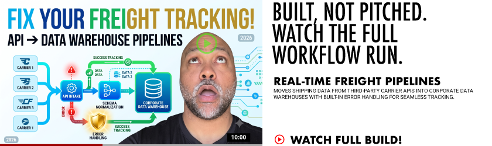

  

# Real-Time Freight Pipelines
### Supply Chain, Logistics & Construction  
Moves shipping data from third-party carrier APIs into corporate data warehouses with built-in error handling for seamless tracking.  
[See Full Build](https://adbyrdllc.wixstudio.com/iautomateshit/demos) 
